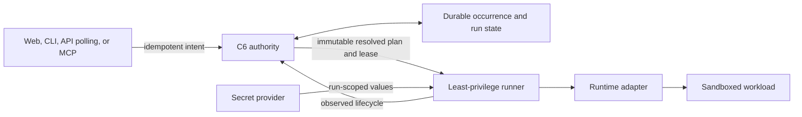

# Agent and runtime architecture

Status: **target design; execution is not implemented**

## Current foundations

- `c6.toml` can describe command, cron, and agent jobs and requested limits.
- The server validates manifests and records run, deployment, schedule, and
  secret-name intent with `dispatchAvailable: false`.
- `c6-scheduler` validates cron and computes a next occurrence; it has no
  persistent tick or dispatch loop.
- `c6-runner` authenticates a bounded Unix-socket protocol and simulates
  lifecycle events; `c6-server` does not call it.
- No process or container is spawned, no secret value is stored or injected,
  and no MCP or event cursor exists.

## Target control flow

Only C6 resolves identity, roles, revision, manifest/config digests, schedule
version, approval, secret grants, and execution policy. The runner receives the
result, not permission to reinterpret it.

## Scheduling and state

A future occurrence is uniquely claimed by `(schedule_id, scheduled_at_utc)`.
Initial policy is `skip` missed occurrences, `forbid` concurrency, no automatic
retry, and one renewable bounded lease. Editing a schedule creates a new
version; existing occurrences retain pinned inputs. Approval binds the exact
revision, configuration, and grants and is invalidated when they change.

Unknown runner outcome becomes `interrupted`. Cancellation is requested until
the adapter confirms a terminal state. These semantics prevent a network retry
from duplicating an externally visible agent or cron action.

## Runtime isolation

The first intended `RuntimeAdapter` is Docker for trusted small-team code. Its
minimum profile includes pinned image digest/provenance, non-root execution,
read-only root, dropped capabilities, no-new-privileges, restrictive seccomp,
bounded processes/CPU/memory/time/scratch, explicit egress, and no host Docker
socket, host network, device, arbitrary mount, or C6 data access.

Containers share a kernel and are not sufficient for hostile multi-tenancy.
Public untrusted execution requires a stronger adapter, likely microVMs, plus
independent security evidence. “Runs in Docker” is never used as shorthand for
“secure.”

## Secrets and repository writes

Secret manifests contain logical names only. A future native provider encrypts
versioned values with a master key outside the data root; 1Password/Doppler
adapters retain opaque references and narrowly scoped operator credentials.
Resolution occurs during run preparation and fails closed. Values enter only
run-scoped memory or tmpfs—not argv, Git, images, DTOs, events, logs, or
artifacts.

Repository access defaults to read-only pinned checkout. A future
`repository_write = "proposal"` grant may return an agent branch and pull
request under a service identity. Direct protected/default-branch writes are
never an agent capability.

## Agent-facing APIs

Machine clients need explicit capability discovery, JSON output, conditional
updates, idempotency, and bounded event polling. A future MCP server is a thin
adapter over those same APIs with a scoped service credential. It cannot query
SQLite, access the runner or secret provider, mint wider credentials, or bypass
approval.

Delivery proceeds through the gates in the
[agent-first runtime specification](../specs/AGENT_FIRST_RUNTIME.md). Each
active C6R archetype is a separate later security and operability gate.
