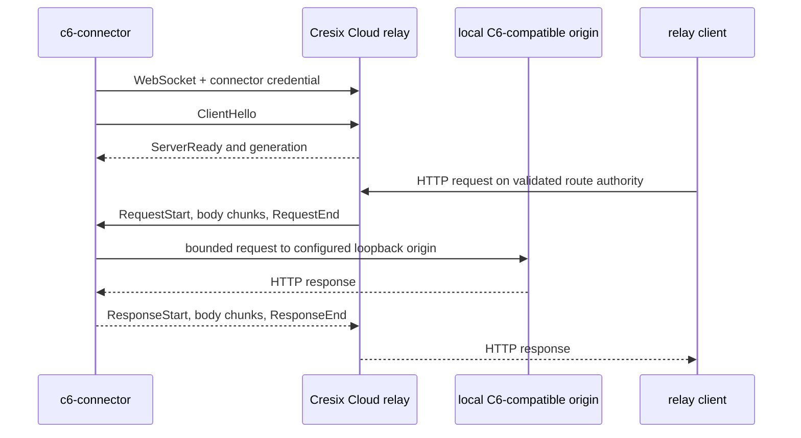

# Connector and relay architecture

## Purpose and non-purpose

The relay gives a registered C6 installation outbound-only managed
reachability. It is not a VPN, raw tunnel, generic forward proxy, Cloud-to-local
SSO mechanism, repository replica, or end-to-end encrypted channel.

## Connection lifecycle

The connector periodically reads project metadata with its separate local API
credential and publishes a bounded catalog. That credential is not injected
into relayed requests. The catalog is discovery metadata; a relayed client's
own local C6 credential is still authenticated and authorized by local C6.

## Implemented dogfood protocol

- WebSocket endpoint: `/api/v1/relay/connect`
- Subprotocol: `c6-relay-v1`
- Strict JSON control frames and bounded binary body frames
- 64 KiB chunks, 16 MiB request bodies, 64 MiB responses
- Protocol ceiling of 32 in-flight requests, but current relay advertises and
  executes one serial request with one bounded queue and deadline
- No automatic request retry
- Exponential reconnect backoff with jitter for transient failures
- Authentication/revocation failures stop until configuration changes
- Hop-by-hop, forwarding, routing, and connector credentials are stripped
- Failed exchanges close and reconnect so request-ID state cannot poison a
  subsequent exchange

The current `ServerReady.generation` field is the constant nonzero placeholder
`1`; it does not order sessions. Cloud assigns a separate opaque in-memory
session identity, replaces the active registry entry when a connector
re-authenticates, and lets only that identity remove itself. A future monotonic
wire generation would require a new implementation and compatibility contract.

The fixed upstream defaults to exactly `http://127.0.0.1:8787`. Owner-only
configuration names separate owner-only files for the connector and local API
credentials. The connector has no database.

## Routing boundary

In the target architecture, the public authority contains an opaque route ID.
Cloud validates it and selects the registered installation; it never trusts a
client forwarding header to choose an upstream. The opaque route remains
stable across workspace rename. Workspace/project slugs resolve directory
metadata but are not trusted network coordinates.

Account cookies are host-only on `cresix.com`. Local C6 cookies belong only to
the isolated installation relay origin. Arbitrary project applications use a
different registrable domain. These origin boundaries prevent unrelated
installations and untrusted apps from sharing cookies or same-origin power.

## Termination and failure semantics

- A newly authenticated connector replaces the previous in-memory session;
  stale-session cleanup cannot remove the replacement.
- Revocation removes ingress and rejects reconnect; local standalone access and
  data survive. Dogfood revocation is irreversible because reissue,
  same-server re-registration, and workspace rebinding are absent.
- Disconnect fails in-flight work. Mutations are never automatically replayed.
- Offline/unknown routes fail explicitly; they do not fall through to another
  installation.
- Oversize traffic, invalid frames, duplicate IDs, illegal transitions, and
  disallowed methods/headers fail closed.
- A Cloud restart loses in-memory presence and routes show offline until the
  connector authenticates again.

## Production gaps

Isolated DNS and TLS routing, public account enrollment/recovery, multi-node
presence, relay HA, rate limiting, admission control, abuse handling, telemetry,
and a real browser-to-C6 authentication journey are unimplemented. The
protocol also excludes raw TCP/UDP, WebSocket upgrades through the tunnel,
trailers, transparent TLS, and relay-blind encryption.

The normative sizes, frames, and residual risks are in the
[connected-mode specification](../specs/CRESIX_CLOUD_CONNECTED_MODE.md).
