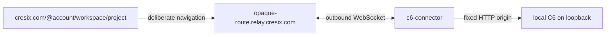

# Deployment topologies

## Supported local shapes

### Laptop, loopback

```text
browser/CLI/Git -> 127.0.0.1:8787 -> c6-server -> local data directory
```

This is the simplest implemented topology and safest evaluation default. The
laptop is the authority: when it sleeps or disconnects, collaboration,
schedules, and any future hosted workloads are unavailable.

### Laptop or server with operator ingress

```text
remote client -> HTTPS reverse proxy, VPN, or tunnel -> private HTTP -> C6
```

This is the supported sharing architecture. ngrok, Tailscale, Cloudflare
Tunnel, Caddy, and ordinary reverse proxies are replaceable ingress adapters.
The public base URL must exactly match the browser origin. The private HTTP hop
must remain loopback or explicitly protected; a direct public C6 listener is
unsupported.

### Always-on Linux or cloud VM

Run the same single authority with persistent storage, supervised processes,
HTTPS ingress, firewalling, monitoring, and coordinated backups. A small VM
does not require Kubernetes, RDS, object storage, or a hosted C6 control plane.
Only one restored copy may resume as writer.

## Optional connected mode



This target removes inbound network configuration while leaving C6 local. One
connector serves one installation; one relay origin represents that
installation even if it hosts several workspaces.

The loopback dogfood doorway still uses the temporary two-segment
`/{workspace}/{project}` route and has no public account handle.

**Dogfood difference:** `c6-cloud` itself binds loopback and exposes a
same-origin relay path for protocol testing. It is not public Cloud, DNS, TLS,
or isolated-origin browser hosting. The Cloud UI truthfully disables opening a
local project through that path.

## Future workload topology

The planned runtime adds a private runner process that accepts immutable,
leased run plans. A Docker adapter is intended first for trusted team code.
Public untrusted workloads require a stronger isolation boundary, such as
microVMs, and a separate content/application domain. Cloud relay isolation is
not workload isolation.

## Unsupported shapes

- multiple C6 server processes sharing one data directory;
- active-active or multi-writer replicas;
- network filesystems for the embedded SQLite/Git boundary;
- direct public plaintext backend exposure;
- using source IP, VPN membership, or tunnel identity as C6 authentication;
- treating Cloud catalog storage as a repository mirror;
- treating the dogfood relay as production multi-tenant ingress;
- giving the control plane a Docker socket.

## Portability and migration

Portability is backup/restore, not replication. Stop or quiesce writers, copy
the complete SQLite/Git data boundary and operator configuration, restore onto
a clean host using the recorded release, configure the new URL, rebind clients,
verify identity and repository refs, and retire the old writer. A public URL
change affects Origin/cookie behavior but does not change the installation ID.

Exact commands and caveats live in [Deployment](../DEPLOYMENT.md) and
[Operations](../OPERATIONS.md).
