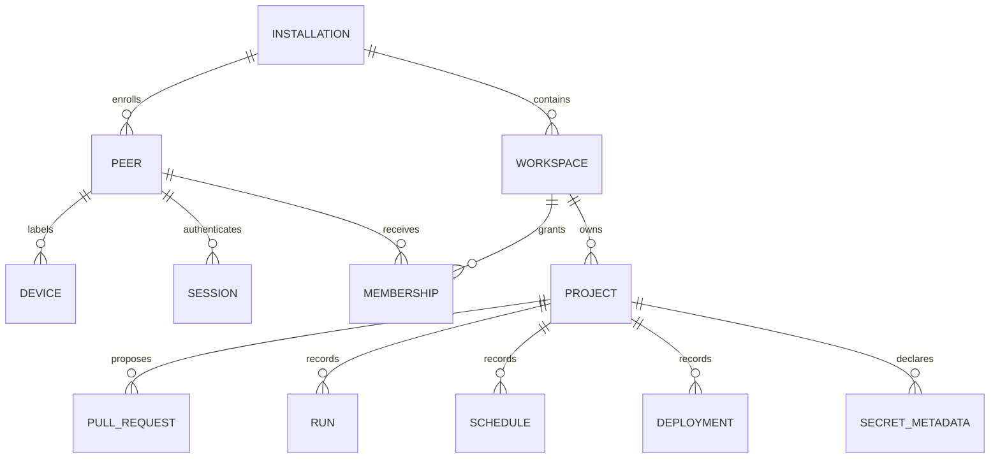
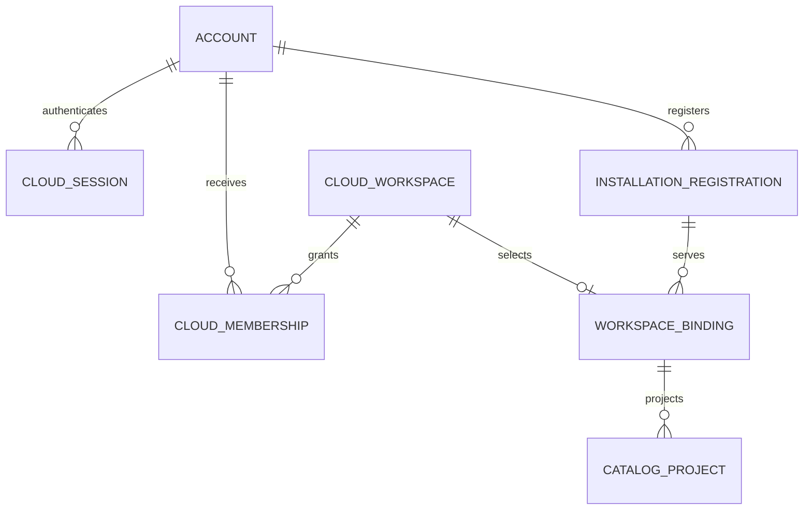

# Domain model and data ownership

## Local installation aggregate

The installation is the local authority and backup boundary. Its stable
identity is independent of the current URL.

Important ownership rules:

- The immutable bootstrap peer is the installation administrator.
- Membership roles authorize workspace/project actions; they do not confer
  installation administration.
- A project owns metadata and points to one UUID-named bare Git repository.
- A revision is a full Git object ID. Git, not SQL, owns its contents.
- Runs, schedules, and deployments currently record intent only.
- Secret metadata records names; values are not stored or injected.

## Cloud aggregate

Cresix Cloud's target boundary owns only globally coordinated concepts. The
dogfood implementation exercises the same model within one preview database:

Cloud namespace ownership, installation registration, connector verifier,
binding, presence, and catalog are Cloud facts. Local membership, source, and
authorization are not copied into Cloud. The dogfood service enforces namespace
uniqueness only inside its one running Cloud instance; it is not yet a globally
hosted namespace authority. One installation may serve several Cloud
workspaces. The dogfood schema permits only one permanent binding row per Cloud
workspace; revocation does not free that row or permit rebinding.

## Same words, different authorities

| Concept | Cloud meaning | Local C6 meaning |
| --- | --- | --- |
| Account/peer | Hosted directory principal | Installation-local collaborator |
| Workspace | Cloud namespace and membership; preview-local today | Local authorization boundary |
| Project | Published catalog projection | Repository and collaboration aggregate |
| Installation | Registered relay destination | Sovereign local authority |
| Session | Cloud account cookie | Local C6 cookie |

IDs are never implicitly interchangeable. A binding explicitly maps a Cloud
workspace UUID to an installation UUID and local workspace UUID. That mapping
does not synchronize membership or mint a local session.

## Derived and ephemeral data

- Cloud catalog rows are derived from local project metadata and may be stale.
- Active connector presence is in Cloud process memory and disappears on
  restart.
- Materialized C6R trees and content-addressed caches are future disposable
  outputs, verified against committed locks.
- Runtime observations will be reconciled into authoritative run state; an
  adapter's raw state is not itself the control-plane truth.

## Identity and naming

Internal identities are server-created UUIDs. Handles, namespaces, project
slugs, and C6R names are validated presentation identifiers, never storage
paths. Cross-installation references must qualify local identifiers with an
installation identity. A URL change is not an installation identity change.

The diagram is a conceptual aggregate, not a table-for-table persistence
schema. For the exact Cloud contract and current implementation shape, see the
[connected-mode specification](../specs/CRESIX_CLOUD_CONNECTED_MODE.md). For
current local records, see [Storage](../STORAGE.md) and [HTTP API](../API.md).
