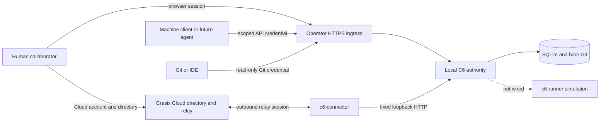

# System context

## Architectural thesis

C6 is decentralized across installations, centralized within an installation,
and Git-distributed at the edge. One self-hosted C6 server is the write
authority for its installation. Target Cresix Cloud adds globally coordinated
discovery and managed reachability without becoming the source, runtime, or
local-policy authority; today's preview proves only single-database semantics.

This is the smallest coherent model for software shared by a handful of people:
one place per local installation to revoke access, one local audit and backup
boundary, ordinary Git clones
for offline work, and no distributed reconciliation protocol.

## Actors and systems

The ingress and Cloud paths are alternatives for reachability. The connector
does not make Cloud a local C6 principal, and operator ingress does not grant
identity based on IP address or network membership.

## Current product boundary

**Implemented:** C6 serves Hub, Admin, JSON API, read-only smart HTTP Git,
SQLite metadata, and bare Git repositories from one installation. Browser,
CLI, and Git credentials are distinct. Runtime intent is recorded, but no
workload is dispatched.

**Dogfood:** `c6-cloud` can be claimed on loopback, manage a workspace,
register and revoke an installation, accept a catalog, and relay bounded HTTP
through `c6-connector` to a fixed loopback backend. The same-origin preview
strips cookies and cannot demonstrate the target browser journey. Namespace
uniqueness is scoped to this single running preview, not a global service.

**Target:** production Cloud uses
`cresix.com/@{account}/{workspace}/{project}` as a
directory and an opaque, isolated origin per installation for actual C6
traffic. Runtime execution, C6R packaging, MCP, hosted apps, and durable event
polling remain future architecture.

## Authority invariants

1. Exactly one writable C6 authority owns a local installation.
2. Git owns objects and refs; SQLite owns control metadata.
3. Cloud catalog data is a bounded, eventually consistent projection and never
   authorizes a local operation.
4. A Cloud account and local C6 peer are distinct principals.
5. Reachability is not identity: URLs, IPs, LANs, VPNs, and tunnel accounts do
   not grant C6 access.
6. Execution must use an isolated runner boundary; the control plane must not
   receive the Docker socket or ambient host credentials.
7. C6R requirements request authority. Only the consuming installation can
   grant it, and only when enforcement is available.

## Out of scope for the current architecture

Multi-writer federation, active-active replicas, Kubernetes, network
filesystems, public anonymous projects, production hosted Cloud, real workload
execution, and hostile multi-tenant hosting are unsupported. Reconsidering
federation requires the evidence and new ADR described in
[ADR 0001](../decisions/0001-single-authority-self-hosting.md).
